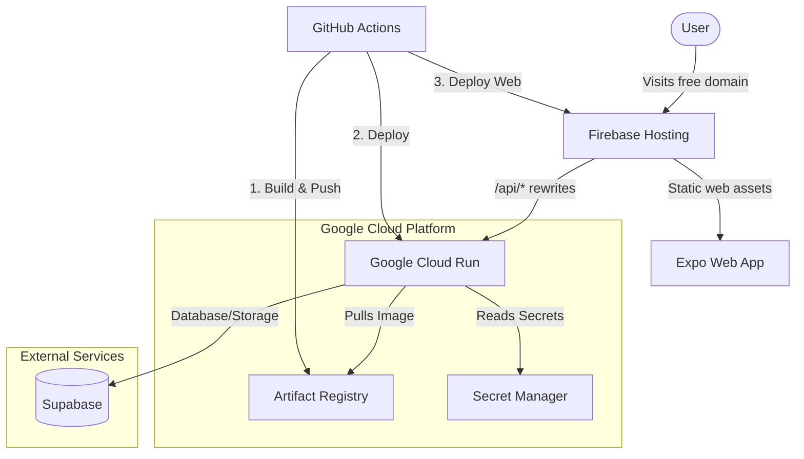

# Deployment Plan: Google Cloud + Firebase Hosting

This plan outlines the deployment strategy for the AI Wardrobe Planner. We will containerize the FastAPI backend and deploy it to Google Cloud Run, leveraging GCP's serverless ecosystem. For the frontend and domain hosting, we will deploy the Expo app as a web application to Firebase Hosting, which provides a free `*.web.app` domain. Firebase Hosting will also act as a reverse proxy to route API traffic to Cloud Run, providing a unified domain and avoiding CORS issues.

## Google Cloud Features & Why We Use Them

1. **Google Cloud Run**
  - **Purpose**: Serverless container execution for the FastAPI backend (`[backend/main.py](backend/main.py)`).
  - **Why**: It scales automatically to zero (saving costs), perfectly handles HTTP requests, and natively supports custom Docker containers which is required for our heavy ML dependencies (`torch`, `ultralytics`, `rembg`).
2. **Google Artifact Registry**
  - **Purpose**: Secure, private registry for Docker images.
  - **Why**: Required to store the backend container images before deploying them to Cloud Run.
3. **Google Secret Manager**
  - **Purpose**: Secure storage for sensitive environment variables.
  - **Why**: Securely stores `SUPABASE_URL`, `SUPABASE_SERVICE_KEY`, and `SERPAPI_KEY` (seen in `[backend/db.py](backend/db.py)`), ensuring they are not exposed in code or plaintext environment variables.
4. **Workload Identity Federation**
  - **Purpose**: Secure authentication mechanism for GitHub Actions.
  - **Why**: Allows GitHub Actions to securely deploy to GCP without needing long-lived, easily compromised service account JSON keys.
5. **Firebase Hosting**
  - **Purpose**: Domain hosting and static asset delivery.
  - **Why**: Provides a free SSL-secured domain (e.g., `misfitai.web.app`), hosts the Expo Web build from `[misfitai-mobile/package.json](misfitai-mobile/package.json)`, and allows **Hosting Rewrites** to route API requests directly to Cloud Run on the same domain.

## Setup & Implementation Steps

1. **GCP & Firebase Project Initialization**
  - Create a Google Cloud Project and link it to a new Firebase Project to obtain the free `.web.app` domain.
  - Enable required APIs: Cloud Run, Artifact Registry, and Secret Manager.
  - Create a Docker repository in Artifact Registry.
2. **Backend Containerization**
  - Create a `[backend/Dockerfile](backend/Dockerfile)` using `python:3.10-slim`.
  - Install system dependencies (e.g., `libgl1` for OpenCV) and Python packages from `[backend/requirements.txt](backend/requirements.txt)`.
3. **Secret Management**
  - Add backend secrets to Secret Manager.
  - Configure the Cloud Run service to mount these secrets as environment variables during runtime.
4. **Firebase Configuration**
  - Initialize Firebase in the repository.
  - Configure `firebase.json` to define the public directory as the Expo web build output.
  - Add a rewrite rule in `firebase.json` pointing specific routes (e.g., `/api/`**) to the Cloud Run service ID.

## Automation via GitHub Actions

We will set up two GitHub Actions workflows to fully automate CI/CD on pushes to the `main` branch:

1. **Backend Deployment Workflow** (`.github/workflows/deploy-backend.yml`)
  - **Trigger**: Pushes modifying the `backend/` directory.
  - **Steps**:
    - Authenticate to GCP using Workload Identity Federation (`google-github-actions/auth`).
    - Set up Google Cloud SDK (`google-github-actions/setup-gcloud`).
    - Authenticate Docker to Artifact Registry.
    - Build the Docker image.
    - Push the image to Artifact Registry.
    - Deploy the new image to Cloud Run using `gcloud run deploy`.
2. **Frontend & Domain Deployment Workflow** (`.github/workflows/deploy-frontend.yml`)
  - **Trigger**: Pushes modifying the `misfitai-mobile/` directory or `firebase.json`.
  - **Steps**:
    - Setup Node.js and run `npm install`.
    - Build the Expo web app using `npx expo export`.
    - Deploy to Firebase Hosting using the official `FirebaseExtended/action-hosting-deploy` action.

